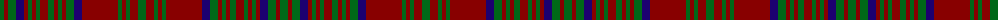

The parent of this is [Matheson (WCWM)](/tartans/g/8/dr4/g8/db8/dr4/g4/dr4/g4/dr8/g6/dr4/g4/dr4/g8/db8/dr36/g4/dr4/g4/dr8/g/8/)

This was sourced from register-of-tartans.  It is a [21 stripes tartan](/stripes/stripes21/).

Original link https://www.tartanregister.gov.uk/tartanDetails.aspx?ref=5026

## Thread count
G/8 DR4 G8 DB8 DR4 G4 DR4 G4 DR8 G6 DR4 G4 DR4 G8 DB8 DR36 G4 DR4 G4 DR8 G/8

## Palette
Each colour and its ΔE from the base-6 reference it is a variant of.

| Colour | Shade | Base | ΔE (OKLab) |
|---|---|---|---|
| DB |  `#1C0070` | B  | 0.14 |
| DR |  `#880000` | R  | 0.14 |
| G |  `#006818` | G  | 0.02 |

ID: /variants/g/8/dr4/g8/db8/dr4/g4/dr4/g4/dr8/g6/dr4/g4/dr4/g8/db8/dr36/g4/dr4/g4/dr8/g/8-db1c0070-dr880000-g006818/
