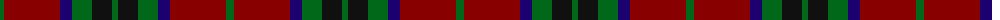

The parent of this is [Canadian Autumn (Fashion)](/tartans/g/8/dr56/db12/g20/k20/g/6/)

This was sourced from tartans-authority.  It is a [6 stripes tartan](/stripes/stripes6/).

Original link http://www.tartansauthority.com/tartan-ferret/display/4440/

## Thread count
G/8 DR56 DB12 G20 K20 G/6

## Palette
Each colour and its ΔE from the base-6 reference it is a variant of.

| Colour | Shade | Base | ΔE (OKLab) |
|---|---|---|---|
| DB |  `#1C0070` | B  | 0.14 |
| DR |  `#880000` | R  | 0.14 |
| G |  `#006818` | G  | 0.02 |
| K |  `#101010` | K  | 0.17 |

# Sample pattern

ID: /variants/g/8/dr56/db12/g20/k20/g/6-db1c0070-dr880000-g006818-k101010/
