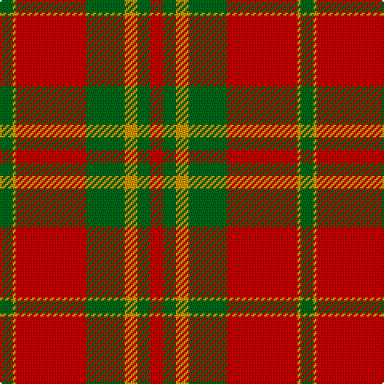

The parent of this is [Spice Apple (Fashion)](/tartans/g/8/dy2/r44/g24/dy8/g8/r/8/)

This was sourced from tartans-authority.  It is a [7 stripes tartan](/stripes/stripes7/).

Original link http://www.tartansauthority.com/tartan-ferret/display/5314/

## Thread count
G/8 DY2 R44 G24 DY8 G8 R/8

## Palette
Each colour and its ΔE from the base-6 reference it is a variant of.

| Colour | Shade | Base | ΔE (OKLab) |
|---|---|---|---|
| DY |  `#D09800` | Y  | 0.11 |
| G |  `#006818` | G  | 0.02 |
| R |  `#C80000` | R  | 0.00 |

# Sample pattern

ID: /variants/g/8/dy2/r44/g24/dy8/g8/r/8-dyd09800-g006818-rc80000/
