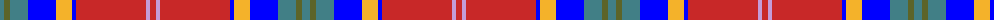

The parent of this is [Hogeboom (Toronto) (Personal)](/tartans/g/8/ga6/g18/b28/y16/b4/r70/lp4/r/6/)

This was sourced from register-of-tartans.  It is a [9 stripes tartan](/stripes/stripes9/).

Original link https://www.tartanregister.gov.uk/tartanDetails.aspx?ref=10634

## Thread count
G/8 Ga6 G18 B28 Y16 B4 R70 LP4 R/6

## Palette
Each colour and its ΔE from the base-6 reference it is a variant of.

| Colour | Shade | Base | ΔE (OKLab) |
|---|---|---|---|
| B |  `#0000FF` | B  | 0.21 |
| G |  `#417F86` | G  | 0.18 |
| Ga |  `#5C6428` | G  | 0.09 |
| LP |  `#C49CD8` | W  | 0.24 |
| R |  `#C82828` | R  | 0.03 |
| Y |  `#F4B22A` | Y  | 0.04 |

ID: /variants/g/8/ga6/g18/b28/y16/b4/r70/lp4/r/6-b0000ff-g417f86-ga5c6428-lpc49cd8-rc82828-yf4b22a/
