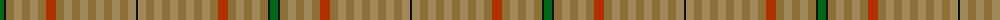

The parent of this is [Peeper (check) (Name)](/tartans/g/8/k2/lt8/lta8/lt8/lta8/lt8/r10/lt8/lta8/lt8/lta8/lt8/lta8/lt8/lta8/lt8/lta8/k/2/)

This was sourced from tartans-authority.  It is a [19 stripes tartan](/stripes/stripes19/).

Original link http://www.tartansauthority.com/tartan-ferret/display/6992/

## Thread count
G/8 K2 LT8 LTa8 LT8 LTa8 LT8 R10 LT8 LTa8 LT8 LTa8 LT8 LTa8 LT8 LTa8 LT8 LTa8 K/2

## Palette
Each colour and its ΔE from the base-6 reference it is a variant of.

| Colour | Shade | Base | ΔE (OKLab) |
|---|---|---|---|
| G |  `#006818` | G  | 0.02 |
| K |  `#101010` | K  | 0.17 |
| LT |  `#8C7038` | G  | 0.18 |
| LTa |  `#A08858` | Y  | 0.21 |
| R |  `#B03000` | R  | 0.05 |

ID: /variants/g/8/k2/lt8/lta8/lt8/lta8/lt8/r10/lt8/lta8/lt8/lta8/lt8/lta8/lt8/lta8/lt8/lta8/k/2-g006818-k101010-lt8c7038-ltaa08858-rb03000/
