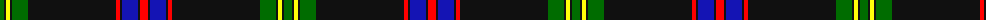

The parent of this is [Marsa Scout Group](/tartans/g/8/k2/y4/k2/g16/k88/r4/k2/b16/k2/r/8/)

This was sourced from register-of-tartans.  It is a [11 stripes tartan](/stripes/stripes11/).

Original link https://www.tartanregister.gov.uk/tartanDetails.aspx?ref=10585

## Thread count
G/8 K2 Y4 K2 G16 K88 R4 K2 B16 K2 R/8

## Palette
Each colour and its ΔE from the base-6 reference it is a variant of.

| Colour | Shade | Base | ΔE (OKLab) |
|---|---|---|---|
| B |  `#1414B4` | B  | 0.12 |
| G |  `#006C00` | G  | 0.03 |
| K |  `#101010` | K  | 0.17 |
| R |  `#FF0000` | R  | 0.11 |
| Y |  `#FFFF0A` | Y  | 0.16 |

ID: /variants/g/8/k2/y4/k2/g16/k88/r4/k2/b16/k2/r/8-b1414b4-g006c00-k101010-rff0000-yffff0a/
