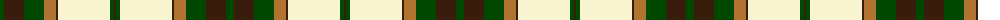
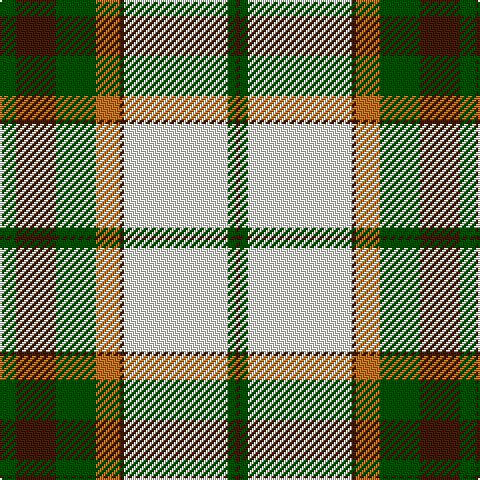

The parent of this is [Dogwood (Fashion)](/tartans/g/8/k20/g20/lt12/k2/ly52/g4/k/2/)

This was sourced from tartans-authority.  It is a [8 stripes tartan](/stripes/stripes8/).

Original link http://www.tartansauthority.com/tartan-ferret/display/913/

## Thread count
G/8 K20 G20 LT12 K2 LY52 G4 K/2

## Palette
Each colour and its ΔE from the base-6 reference it is a variant of.

| Colour | Shade | Base | ΔE (OKLab) |
|---|---|---|---|
| G |  `#004800` | G  | 0.09 |
| K |  `#381C0C` | B  | 0.21 |
| LT |  `#B07430` | R  | 0.17 |
| LY |  `#F8F4D0` | W  | 0.04 |

# Sample pattern

ID: /variants/g/8/k20/g20/lt12/k2/ly52/g4/k/2-g004800-k381c0c-ltb07430-lyf8f4d0/
