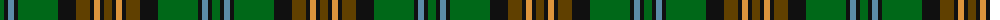

The parent of this is [Choinka Family (Personal)](/tartans/g/8/k4/b6/k4/g40/k18/t14/k4/o6/k4/t/8/)

This was sourced from tartans-authority.  It is a [11 stripes tartan](/stripes/stripes11/).

Original link http://www.tartansauthority.com/tartan-ferret/display/10624/

## Thread count
G/8 K4 B6 K4 G40 K18 T14 K4 O6 K4 T/8

## Palette
Each colour and its ΔE from the base-6 reference it is a variant of.

| Colour | Shade | Base | ΔE (OKLab) |
|---|---|---|---|
| B |  `#5C8CA8` | B  | 0.23 |
| G |  `#006818` | G  | 0.02 |
| K |  `#101010` | K  | 0.17 |
| O |  `#DC943C` | Y  | 0.12 |
| T |  `#604000` | G  | 0.14 |

ID: /variants/g/8/k4/b6/k4/g40/k18/t14/k4/o6/k4/t/8-b5c8ca8-g006818-k101010-odc943c-t604000/
