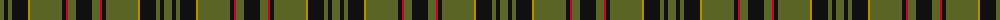

The parent of this is [Manitoba Cue (Corporate)](/tartans/g/8/k4/g4/k16/dy2/g32/k4/r2/g8/k/16/)

This was sourced from tartans-authority.  It is a [10 stripes tartan](/stripes/stripes10/).

Original link http://www.tartansauthority.com/tartan-ferret/display/10454/

## Thread count
G/8 K4 G4 K16 DY2 G32 K4 R2 G8 K/16

## Palette
Each colour and its ΔE from the base-6 reference it is a variant of.

| Colour | Shade | Base | ΔE (OKLab) |
|---|---|---|---|
| DY |  `#BC8C00` | Y  | 0.16 |
| G |  `#5C6428` | G  | 0.09 |
| K |  `#101010` | K  | 0.17 |
| R |  `#C8002C` | R  | 0.03 |

ID: /variants/g/8/k4/g4/k16/dy2/g32/k4/r2/g8/k/16-dybc8c00-g5c6428-k101010-rc8002c/
