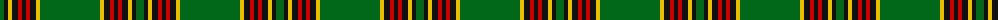

The parent of this is [Forde (Name)](/tartans/g/8/k4/y4/k6/r4/k4/r4/k6/y4/g/60/)

This was sourced from tartans-authority.  It is a [10 stripes tartan](/stripes/stripes10/).

Original link http://www.tartansauthority.com/tartan-ferret/display/829/

## Thread count
G/8 K4 Y4 K6 R4 K4 R4 K6 Y4 G/60

## Palette
Each colour and its ΔE from the base-6 reference it is a variant of.

| Colour | Shade | Base | ΔE (OKLab) |
|---|---|---|---|
| G |  `#006818` | G  | 0.02 |
| K |  `#101010` | K  | 0.17 |
| R |  `#C80000` | R  | 0.00 |
| Y |  `#E8C000` | Y  | 0.00 |

ID: /variants/g/8/k4/y4/k6/r4/k4/r4/k6/y4/g/60-g006818-k101010-rc80000-ye8c000/
