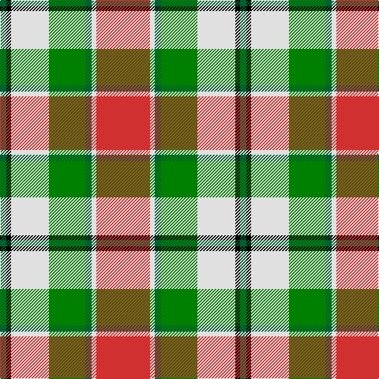

The parent of this is [MacLachlan, dress](/tartans/g/8/k6/ln48/ga46/g8/ln6/r/68/)

This was sourced from weddslist.  It is a [7 stripes tartan](/stripes/stripes7/).

Original link http://www.weddslist.com/cgi-bin/tartans/pg.pl?source=sts

## Thread count
G/8 K6 LN48 Ga46 G8 LN6 R/68

## Palette
Each colour and its ΔE from the base-6 reference it is a variant of.

| Colour | Shade | Base | ΔE (OKLab) |
|---|---|---|---|
| G |  `#006030` | G  | 0.04 |
| Ga |  `#008000` | G  | 0.09 |
| K |  `#000000` | K  | 0.00 |
| LN |  `#E0E0E0` | W  | 0.06 |
| R |  `#D03030` | R  | 0.05 |

# Sample pattern

ID: /variants/g/8/k6/ln48/ga46/g8/ln6/r/68-g006030-ga008000-k000000-lne0e0e0-rd03030/
