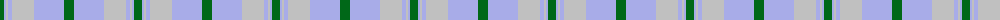
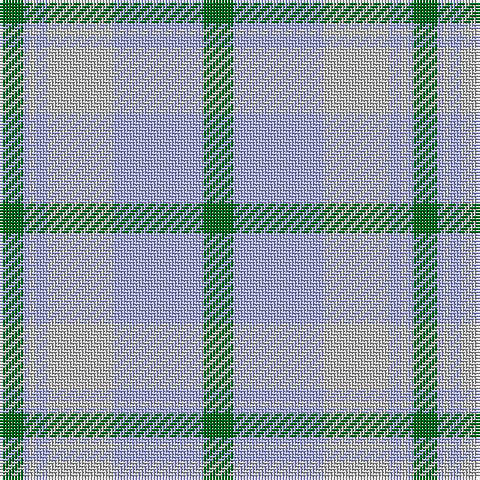

The parent of this is [Highlands Country Club (Corporate)](/tartans/g/8/lp2/n2/lp4/n22/lpa30/g/10/)

This was sourced from tartans-authority.  It is a [7 stripes tartan](/stripes/stripes7/).

Original link http://www.tartansauthority.com/tartan-ferret/display/687/

## Thread count
G/8 LP2 N2 LP4 N22 LPa30 G/10

## Palette
Each colour and its ΔE from the base-6 reference it is a variant of.

| Colour | Shade | Base | ΔE (OKLab) |
|---|---|---|---|
| G |  `#006818` | G  | 0.02 |
| LP |  `#A8ACE8` | W  | 0.22 |
| LPa |  `#A8ACE8` | W  | 0.22 |
| N |  `#C0C0C0` | W  | 0.16 |
| Na |  `#C0C0C0` | W  | 0.16 |

# Sample pattern

ID: /variants/g/8/lp2/n2/lp4/n22/lpa30/g/10-g006818-lpa8ace8-lpaa8ace8-nc0c0c0-nac0c0c0/
