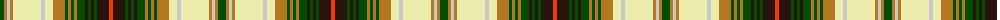

The parent of this is [Drymen](/tartans/g/8/lt3/n3/lt3/w28/n4/w8/lt12/g3/lt3/g3/lt3/g8/k3/g3/k3/g3/k12/r/4/)

This was sourced from register-of-tartans.  It is a [19 stripes tartan](/stripes/stripes19/).

Original link https://www.tartanregister.gov.uk/tartanDetails.aspx?ref=997

## Thread count
G/8 LT3 N3 LT3 W28 N4 W8 LT12 G3 LT3 G3 LT3 G8 K3 G3 K3 G3 K12 R/4

## Palette
Each colour and its ΔE from the base-6 reference it is a variant of.

| Colour | Shade | Base | ΔE (OKLab) |
|---|---|---|---|
| G |  `#004C00` | G  | 0.08 |
| K |  `#28140C` | K  | 0.22 |
| LT |  `#B47820` | R  | 0.18 |
| N |  `#C8C8C8` | W  | 0.13 |
| R |  `#F03C00` | R  | 0.11 |
| W |  `#ECECAC` | W  | 0.09 |

ID: /variants/g/8/lt3/n3/lt3/w28/n4/w8/lt12/g3/lt3/g3/lt3/g8/k3/g3/k3/g3/k12/r/4-g004c00-k28140c-ltb47820-nc8c8c8-rf03c00-wececac/
