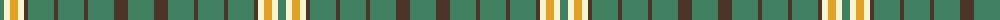

The parent of this is [McGrane (2014)](/tartans/g/8/ly6/y8/ly6/t4/g26/t4/g26/t4/g26/t14/g/26/)

This was sourced from register-of-tartans.  It is a [12 stripes tartan](/stripes/stripes12/).

Original link https://www.tartanregister.gov.uk/tartanDetails.aspx?ref=11076

## Thread count
G/8 LY6 Y8 LY6 T4 G26 T4 G26 T4 G26 T14 G/26

## Palette
Each colour and its ΔE from the base-6 reference it is a variant of.

| Colour | Shade | Base | ΔE (OKLab) |
|---|---|---|---|
| G |  `#408060` | G  | 0.13 |
| LY |  `#F8F4D0` | W  | 0.04 |
| T |  `#4C3428` | B  | 0.16 |
| Y |  `#E0A126` | Y  | 0.08 |

ID: /variants/g/8/ly6/y8/ly6/t4/g26/t4/g26/t4/g26/t14/g/26-g408060-lyf8f4d0-t4c3428-ye0a126/
