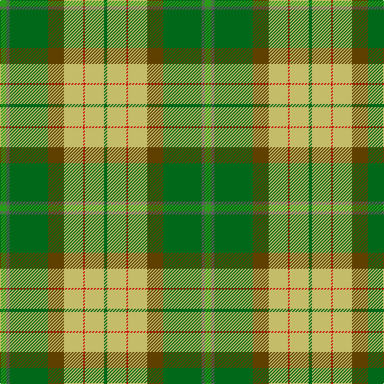

The parent of this is [Jolley (Personal)](/tartans/g/8/n4/ga48/t20/lg24/r2/lg24/ga/4/)

This was sourced from tartans-authority.  It is a [8 stripes tartan](/stripes/stripes8/).

Original link http://www.tartansauthority.com/tartan-ferret/display/10503/

## Thread count
G/8 N4 Ga48 T20 LG24 R2 LG24 Ga/4

## Palette
Each colour and its ΔE from the base-6 reference it is a variant of.

| Colour | Shade | Base | ΔE (OKLab) |
|---|---|---|---|
| G |  `#289C18` | G  | 0.18 |
| Ga |  `#006818` | G  | 0.02 |
| LG |  `#C4BC68` | Y  | 0.07 |
| N |  `#5C5C5C` | B  | 0.14 |
| R |  `#C80000` | R  | 0.00 |
| T |  `#604000` | G  | 0.14 |

# Sample pattern

ID: /variants/g/8/n4/ga48/t20/lg24/r2/lg24/ga/4-g289c18-ga006818-lgc4bc68-n5c5c5c-rc80000-t604000/
