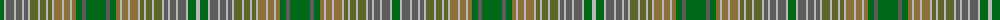

The parent of this is [Kirkton](/tartans/g/8/na2/n8/na2/n6/na2/n4/na2/ga8/na2/ga6/na2/ga4/na2/lt8/na2/lt6/na2/lt4/g6/n4/g20/n4/g6/lt4/na2/lt6/na2/lt8/na2/ga4/na2/ga6/na2/ga8/na2/n4/na2/n6/na2/n8/na2/g8/na/4/)

This was sourced from register-of-tartans.  It is a [44 stripes tartan](/stripes/stripes44/).

Original link https://www.tartanregister.gov.uk/tartanDetails.aspx?ref=2006

## Thread count
G/8 Na2 N8 Na2 N6 Na2 N4 Na2 Ga8 Na2 Ga6 Na2 Ga4 Na2 LT8 Na2 LT6 Na2 LT4 G6 N4 G20 N4 G6 LT4 Na2 LT6 Na2 LT8 Na2 Ga4 Na2 Ga6 Na2 Ga8 Na2 N4 Na2 N6 Na2 N8 Na2 G8 Na/4

## Palette
Each colour and its ΔE from the base-6 reference it is a variant of.

| Colour | Shade | Base | ΔE (OKLab) |
|---|---|---|---|
| G |  `#006818` | G  | 0.02 |
| Ga |  `#5C6428` | G  | 0.09 |
| LT |  `#8C7038` | G  | 0.18 |
| N |  `#5C5C5C` | B  | 0.14 |
| Na |  `#B8B8B8` | Y  | 0.17 |

ID: /variants/g/8/na2/n8/na2/n6/na2/n4/na2/ga8/na2/ga6/na2/ga4/na2/lt8/na2/lt6/na2/lt4/g6/n4/g20/n4/g6/lt4/na2/lt6/na2/lt8/na2/ga4/na2/ga6/na2/ga8/na2/n4/na2/n6/na2/n8/na2/g8/na/4-g006818-ga5c6428-lt8c7038-n5c5c5c-nab8b8b8/
