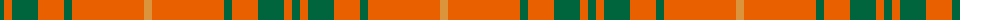

The parent of this is [Wolfe (Name)](/tartans/g/8/oa8/g26/oa26/g8/oa72/o/8/)

This was sourced from tartans-authority.  It is a [7 stripes tartan](/stripes/stripes7/).

Original link http://www.tartansauthority.com/tartan-ferret/display/4096/

## Thread count
G/8 Oa8 G26 Oa26 G8 Oa72 O/8

## Palette
Each colour and its ΔE from the base-6 reference it is a variant of.

| Colour | Shade | Base | ΔE (OKLab) |
|---|---|---|---|
| G |  `#00643C` | G  | 0.06 |
| O |  `#DC943C` | Y  | 0.12 |
| Oa |  `#E86000` | R  | 0.14 |

# Sample pattern

ID: /variants/g/8/oa8/g26/oa26/g8/oa72/o/8-g00643c-odc943c-oae86000/
