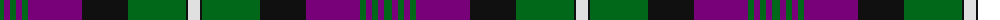

The parent of this is [Rennie Family Tartan Tartan Number: 716. Earliest known date: 1981. For Robin Rennie. The accreditation list gives the author and weaver, James Scarlett, as the designer in 1980. The tartan register records the designer as Peter MacDonald who worked as a weaver for the Scottish Tartans Society in 1981. Rennies, Rainys and Rainnies (from 'Ranald') are listed as a sept of MacDonell of Keppoch. See products available Copyright © Blair Urquhart, Comrie, 2015](/tartans/g/8/p6/g6/p6/g6/p54/k46/g58/k2/ln/12/)

This was sourced from house-of-tartan.  It is a [10 stripes tartan](/stripes/stripes10/).

Original link http://www.house-of-tartan.scotland.net/house/TartanViewjs.asp?colr=Def&tnam=716

## Thread count
G/8 P6 G6 P6 G6 P54 K46 G58 K2 LN/12

## Palette
Each colour and its ΔE from the base-6 reference it is a variant of.

| Colour | Shade | Base | ΔE (OKLab) |
|---|---|---|---|
| G |  `#006818` | G  | 0.02 |
| K |  `#101010` | K  | 0.17 |
| LN |  `#E0E0E0` | W  | 0.06 |
| P |  `#780078` | B  | 0.16 |

ID: /variants/g/8/p6/g6/p6/g6/p54/k46/g58/k2/ln/12-g006818-k101010-lne0e0e0-p780078/
