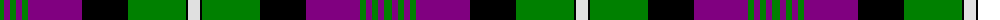

The parent of this is [Rennie](/tartans/g/8/p6/g6/p6/g6/p54/k46/g58/k2/ln/12/)

This was sourced from weddslist.  It is a [10 stripes tartan](/stripes/stripes10/).

Original link http://www.weddslist.com/cgi-bin/tartans/pg.pl?source=sts

## Thread count
G/8 P6 G6 P6 G6 P54 K46 G58 K2 LN/12

## Palette
Each colour and its ΔE from the base-6 reference it is a variant of.

| Colour | Shade | Base | ΔE (OKLab) |
|---|---|---|---|
| G |  `#008000` | G  | 0.09 |
| K |  `#000000` | K  | 0.00 |
| LN |  `#E0E0E0` | W  | 0.06 |
| P |  `#800080` | B  | 0.17 |

ID: /variants/g/8/p6/g6/p6/g6/p54/k46/g58/k2/ln/12-g008000-k000000-lne0e0e0-p800080/
