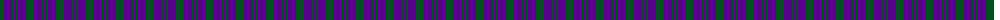
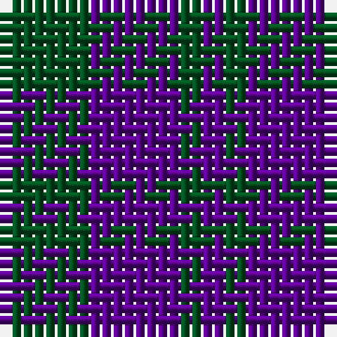

The parent of this is [Wilson's No 211](/tartans/g/8/p8/g2/p/2/)

This was sourced from register-of-tartans.  It is a [4 stripes tartan](/stripes/stripes4/).

Original link https://www.tartanregister.gov.uk/tartanDetails.aspx?ref=4639

## Thread count
G/8 P8 G2 P/2

## Palette
Each colour and its ΔE from the base-6 reference it is a variant of.

| Colour | Shade | Base | ΔE (OKLab) |
|---|---|---|---|
| G |  `#005020` | G  | 0.08 |
| P |  `#5A008C` | B  | 0.12 |

# Sample pattern

ID: /variants/g/8/p8/g2/p/2-g005020-p5a008c/
