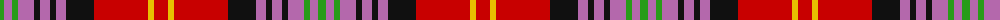

The parent of this is [Scotland's People](/tartans/g/8/p8/g6/p16/k6/p10/k6/p10/k28/r54/y6/r/14/)

This was sourced from register-of-tartans.  It is a [12 stripes tartan](/stripes/stripes12/).

Original link https://www.tartanregister.gov.uk/tartanDetails.aspx?ref=3685

## Thread count
G/8 P8 G6 P16 K6 P10 K6 P10 K28 R54 Y6 R/14

## Palette
Each colour and its ΔE from the base-6 reference it is a variant of.

| Colour | Shade | Base | ΔE (OKLab) |
|---|---|---|---|
| G |  `#289C18` | G  | 0.18 |
| K |  `#101010` | K  | 0.17 |
| O |  `#D87C00` | Y  | 0.17 |
| P |  `#B468AC` | R  | 0.21 |
| R |  `#C80000` | R  | 0.00 |
| Y |  `#E8C000` | Y  | 0.00 |

ID: /variants/g/8/p8/g6/p16/k6/p10/k6/p10/k28/r54/y6/r/14-g289c18-k101010-od87c00-pb468ac-rc80000-ye8c000/
