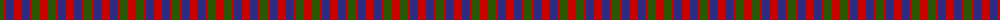
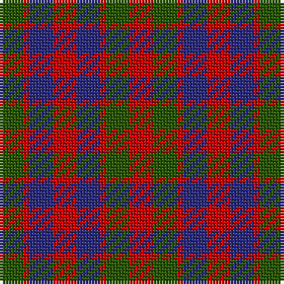

The parent of this is [Gow](/tartans/g/8/r2/db8/r8/db8/r2/g8/r/8/)

This was sourced from register-of-tartans.  It is a [8 stripes tartan](/stripes/stripes8/).

Original link https://www.tartanregister.gov.uk/tartanDetails.aspx?ref=1472

## Thread count
G/8 R2 DB8 R8 DB8 R2 G8 R/8

## Palette
Each colour and its ΔE from the base-6 reference it is a variant of.

| Colour | Shade | Base | ΔE (OKLab) |
|---|---|---|---|
| DB |  `#2C2C80` | B  | 0.05 |
| DG |  `#003820` | G  | 0.16 |
| G |  `#285800` | G  | 0.04 |
| Ga |  `#006818` | G  | 0.02 |
| Gb |  `#289C18` | G  | 0.18 |
| R |  `#C80000` | R  | 0.00 |

# Sample pattern

ID: /variants/g/8/r2/db8/r8/db8/r2/g8/r/8-db2c2c80-dg003820-g285800-ga006818-gb289c18-rc80000/
