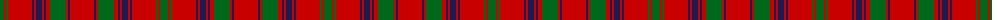

The parent of this is [MacColl (Clan)](/tartans/g/8/r2/g2/r24/db2/r2/db6/r2/db2/r4/g16/r2/db2/r/24/)

This was sourced from tartans-authority.  It is a [14 stripes tartan](/stripes/stripes14/).

Original link http://www.tartansauthority.com/tartan-ferret/display/878/

## Thread count
G/8 R2 G2 R24 DB2 R2 DB6 R2 DB2 R4 G16 R2 DB2 R/24

## Palette
Each colour and its ΔE from the base-6 reference it is a variant of.

| Colour | Shade | Base | ΔE (OKLab) |
|---|---|---|---|
| DB |  `#1C1C50` | B  | 0.14 |
| G |  `#006818` | G  | 0.02 |
| R |  `#C80000` | R  | 0.00 |

ID: /variants/g/8/r2/g2/r24/db2/r2/db6/r2/db2/r4/g16/r2/db2/r/24-db1c1c50-g006818-rc80000/
