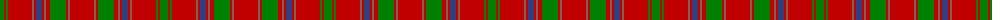

The parent of this is [MacColl](/tartans/g/8/r2/g2/r24/lt2/r2/b6/r2/lt2/r4/g16/r2/lt2/r/24/)

This was sourced from weddslist.  It is a [14 stripes tartan](/stripes/stripes14/).

Original link http://www.weddslist.com/cgi-bin/tartans/pg.pl?source=sts

## Thread count
G/8 R2 G2 R24 LT2 R2 B6 R2 LT2 R4 G16 R2 LT2 R/24

## Palette
Each colour and its ΔE from the base-6 reference it is a variant of.

| Colour | Shade | Base | ΔE (OKLab) |
|---|---|---|---|
| B |  `#304080` | B  | 0.01 |
| G |  `#008000` | G  | 0.09 |
| LT |  `#806050` | R  | 0.17 |
| R |  `#C00000` | R  | 0.02 |

ID: /variants/g/8/r2/g2/r24/lt2/r2/b6/r2/lt2/r4/g16/r2/lt2/r/24-b304080-g008000-lt806050-rc00000/
