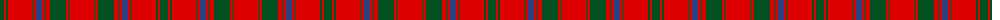

The parent of this is [MacColl #3](/tartans/g/8/r2/g2/r24/t2/r2/b6/r2/t2/r4/g16/r2/t2/r/24/)

This was sourced from register-of-tartans.  It is a [14 stripes tartan](/stripes/stripes14/).

Original link https://www.tartanregister.gov.uk/tartanDetails.aspx?ref=2317

## Thread count
G/8 R2 G2 R24 T2 R2 B6 R2 T2 R4 G16 R2 T2 R/24

## Palette
Each colour and its ΔE from the base-6 reference it is a variant of.

| Colour | Shade | Base | ΔE (OKLab) |
|---|---|---|---|
| B |  `#2C4084` | B  | 0.00 |
| G |  `#005020` | G  | 0.08 |
| R |  `#DC0000` | R  | 0.04 |
| T |  `#503C14` | G  | 0.15 |

ID: /variants/g/8/r2/g2/r24/t2/r2/b6/r2/t2/r4/g16/r2/t2/r/24-b2c4084-g005020-rdc0000-t503c14/
