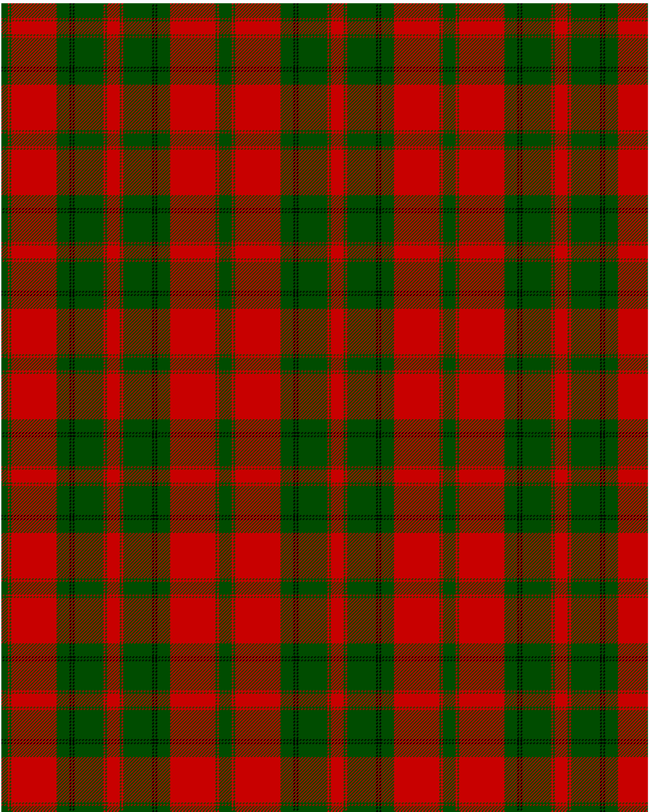

The parent of this is [Drummond VS](/tartans/g/8/r2/g2/r56/g16/k2/g2/k2/g36/r2/g2/r/8/)

This was sourced from <no value>.  It is a [12 stripes tartan](/stripes/stripes12/).

Original link http://www.weddslist.com/cgi-bin/tartans/pg.pl?source=rb

## Thread count
G/8 R2 G2 R56 G16 K2 G2 K2 G36 R2 G2 R/8

## Palette
G K R

# Sample pattern

ID: /variants/g/8/r2/g2/r56/g16/k2/g2/k2/g36/r2/g2/r/8-g004c00-k000000-rc80000/