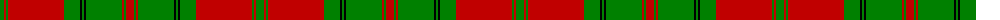

The parent of this is [Drummond](/tartans/g/8/r2/g2/r56/g16/k2/g2/k2/g36/r2/g2/r/8/)

This was sourced from weddslist.  It is a [12 stripes tartan](/stripes/stripes12/).

Original link http://www.weddslist.com/cgi-bin/tartans/pg.pl?source=sts

## Thread count
G/8 R2 G2 R56 G16 K2 G2 K2 G36 R2 G2 R/8

## Palette
Each colour and its ΔE from the base-6 reference it is a variant of.

| Colour | Shade | Base | ΔE (OKLab) |
|---|---|---|---|
| G |  `#008000` | G  | 0.09 |
| K |  `#000000` | K  | 0.00 |
| R |  `#C00000` | R  | 0.02 |

ID: /variants/g/8/r2/g2/r56/g16/k2/g2/k2/g36/r2/g2/r/8-g008000-k000000-rc00000/
