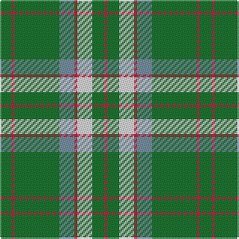

The parent of this is [McGirr (Letterkenny) David, (Pers.)](/tartans/g/8/r2/g30/b10/r2/ln10/g8/r/2/)

This was sourced from tartans-authority.  It is a [8 stripes tartan](/stripes/stripes8/).

Original link http://www.tartansauthority.com/tartan-ferret/display/10271/

## Thread count
G/8 R2 G30 B10 R2 LN10 G8 R/2

## Palette
Each colour and its ΔE from the base-6 reference it is a variant of.

| Colour | Shade | Base | ΔE (OKLab) |
|---|---|---|---|
| B |  `#68889C` | B  | 0.23 |
| G |  `#006818` | G  | 0.02 |
| LN |  `#E0E0E0` | W  | 0.06 |
| R |  `#C8002C` | R  | 0.03 |

# Sample pattern

ID: /variants/g/8/r2/g30/b10/r2/ln10/g8/r/2-b68889c-g006818-lne0e0e0-rc8002c/
