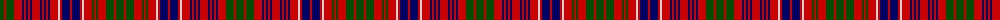

The parent of this is [MacRae](/tartans/g/8/r2/g8/r8/db2/r2/db2/r2/db2/r8/db2/r2/db2/r2/db2/r8/n2/r2/db8/r2/db8/r2/n2/r8/g2/r2/g2/r8/g8/r2/g/8/)

This was sourced from weddslist.  It is a [31 stripes tartan](/stripes/stripes31/).

Original link http://www.weddslist.com/cgi-bin/tartans/pg.pl?source=rb

## Thread count
G/8 R2 G8 R8 DB2 R2 DB2 R2 DB2 R8 DB2 R2 DB2 R2 DB2 R8 N2 R2 DB8 R2 DB8 R2 N2 R8 G2 R2 G2 R8 G8 R2 G/8

## Palette
Each colour and its ΔE from the base-6 reference it is a variant of.

| Colour | Shade | Base | ΔE (OKLab) |
|---|---|---|---|
| DB |  `#000064` | B  | 0.17 |
| G |  `#004C00` | G  | 0.08 |
| N |  `#D0D0D0` | W  | 0.11 |
| R |  `#C80000` | R  | 0.00 |

ID: /variants/g/8/r2/g8/r8/db2/r2/db2/r2/db2/r8/db2/r2/db2/r2/db2/r8/n2/r2/db8/r2/db8/r2/n2/r8/g2/r2/g2/r8/g8/r2/g/8-db000064-g004c00-nd0d0d0-rc80000/
