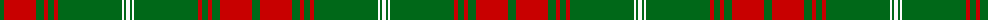

The parent of this is [Rothesay #2](/tartans/g/8/r32/g8/r4/g6/r4/g64/w2/g2/w/4/)

This was sourced from register-of-tartans.  It is a [10 stripes tartan](/stripes/stripes10/).

Original link https://www.tartanregister.gov.uk/tartanDetails.aspx?ref=3572

## Thread count
G/8 R32 G8 R4 G6 R4 G64 W2 G2 W/4

## Palette
Each colour and its ΔE from the base-6 reference it is a variant of.

| Colour | Shade | Base | ΔE (OKLab) |
|---|---|---|---|
| G |  `#006818` | G  | 0.02 |
| R |  `#C80000` | R  | 0.00 |
| W |  `#FCFCFC` | W  | 0.03 |

ID: /variants/g/8/r32/g8/r4/g6/r4/g64/w2/g2/w/4-g006818-rc80000-wfcfcfc/
