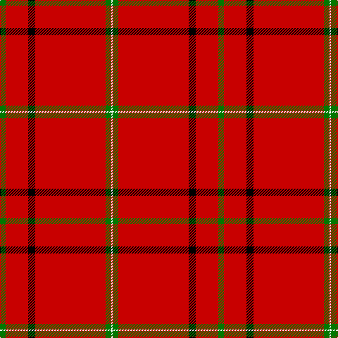

The parent of this is [Chalet (Fashion)](/tartans/g/8/r32/k10/r100/g8/w/2/)

This was sourced from tartans-authority.  It is a [6 stripes tartan](/stripes/stripes6/).

Original link http://www.tartansauthority.com/tartan-ferret/display/4489/

## Thread count
G/8 R32 K10 R100 G8 W/2

## Palette
Each colour and its ΔE from the base-6 reference it is a variant of.

| Colour | Shade | Base | ΔE (OKLab) |
|---|---|---|---|
| G |  `#007800` | G  | 0.06 |
| K |  `#000000` | K  | 0.00 |
| R |  `#C80000` | R  | 0.00 |
| W |  `#FCFCFC` | W  | 0.03 |

# Sample pattern

ID: /variants/g/8/r32/k10/r100/g8/w/2-g007800-k000000-rc80000-wfcfcfc/
