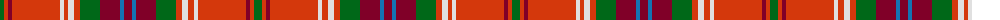

The parent of this is [Trost (Corporate)](/tartans/g/8/r4/dr4/r48/ln4/r4/ln6/r6/g20/dr20/b4/dr8/b4/dr20/g20/r6/ln6/r6/ln4/r48/dr4/r4/g/8/)

This was sourced from tartans-authority.  It is a [23 stripes tartan](/stripes/stripes23/).

Original link http://www.tartansauthority.com/tartan-ferret/display/3811/

## Thread count
G/8 R4 DR4 R48 LN4 R4 LN6 R6 G20 DR20 B4 DR8 B4 DR20 G20 R6 LN6 R6 LN4 R48 DR4 R4 G/8

## Palette
Each colour and its ΔE from the base-6 reference it is a variant of.

| Colour | Shade | Base | ΔE (OKLab) |
|---|---|---|---|
| B |  `#1474B4` | B  | 0.15 |
| DR |  `#800028` | R  | 0.16 |
| G |  `#006818` | G  | 0.02 |
| LN |  `#E0E0E0` | W  | 0.06 |
| R |  `#D4380C` | R  | 0.06 |

ID: /variants/g/8/r4/dr4/r48/ln4/r4/ln6/r6/g20/dr20/b4/dr8/b4/dr20/g20/r6/ln6/r6/ln4/r48/dr4/r4/g/8-b1474b4-dr800028-g006818-lne0e0e0-rd4380c/
