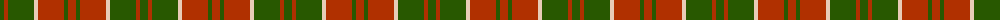

The parent of this is [Crossnor (Corporate)](/tartans/g/8/r4/g26/lr4/r26/g4/r/8/)

This was sourced from tartans-authority.  It is a [7 stripes tartan](/stripes/stripes7/).

Original link http://www.tartansauthority.com/tartan-ferret/display/6282/

## Thread count
G/8 R4 G26 LR4 R26 G4 R/8

## Palette
Each colour and its ΔE from the base-6 reference it is a variant of.

| Colour | Shade | Base | ΔE (OKLab) |
|---|---|---|---|
| G |  `#285800` | G  | 0.04 |
| LR |  `#E8CCB8` | W  | 0.11 |
| R |  `#B03000` | R  | 0.05 |

# Sample pattern

ID: /variants/g/8/r4/g26/lr4/r26/g4/r/8-g285800-lre8ccb8-rb03000/
