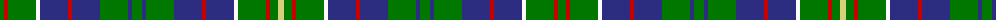

The parent of this is [Hunter of Hunterston](/tartans/g/8/r4/g28/w4/dba28/r4/dba28/g28/dba4/g10/dba4/g28/dba28/r4/dba28/w4/g28/r4/g8/lg/6/)

This was sourced from register-of-tartans.  It is a [20 stripes tartan](/stripes/stripes20/).

Original link https://www.tartanregister.gov.uk/tartanDetails.aspx?ref=1793

## Thread count
G/8 R4 G28 W4 DBa28 R4 DBa28 G28 DBa4 G10 DBa4 G28 DBa28 R4 DBa28 W4 G28 R4 G8 LG/6

## Palette
Each colour and its ΔE from the base-6 reference it is a variant of.

| Colour | Shade | Base | ΔE (OKLab) |
|---|---|---|---|
| DB |  `#00008C` | B  | 0.13 |
| DBa |  `#2C2C80` | B  | 0.05 |
| DR |  `#8C0000` | R  | 0.13 |
| G |  `#007800` | G  | 0.06 |
| LG |  `#D8D078` | Y  | 0.07 |
| N |  `#C8C8C8` | W  | 0.13 |
| R |  `#C80000` | R  | 0.00 |
| W |  `#FCFCFC` | W  | 0.03 |

ID: /variants/g/8/r4/g28/w4/dba28/r4/dba28/g28/dba4/g10/dba4/g28/dba28/r4/dba28/w4/g28/r4/g8/lg/6-db00008c-dba2c2c80-dr8c0000-g007800-lgd8d078-nc8c8c8-rc80000-wfcfcfc/
