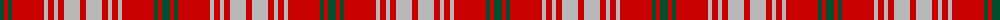

The parent of this is [Queen Alexandra (Fashion)](/tartans/g/8/r4/g4/r32/n4/r6/n4/r6/n16/r/6/)

This was sourced from tartans-authority.  It is a [10 stripes tartan](/stripes/stripes10/).

Original link http://www.tartansauthority.com/tartan-ferret/display/972/

## Thread count
G/8 R4 G4 R32 N4 R6 N4 R6 N16 R/6

## Palette
Each colour and its ΔE from the base-6 reference it is a variant of.

| Colour | Shade | Base | ΔE (OKLab) |
|---|---|---|---|
| G |  `#005030` | G  | 0.09 |
| N |  `#B8B8B8` | Y  | 0.17 |
| R |  `#C80000` | R  | 0.00 |

ID: /variants/g/8/r4/g4/r32/n4/r6/n4/r6/n16/r/6-g005030-nb8b8b8-rc80000/
