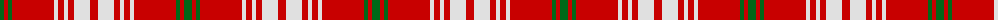

The parent of this is [Queen Alexandra Tartan Tartan Number: 972. Earliest known date: pre 2003 The Scottish Tartans Society received a sample from A.C.Lumsden which is slightly different. (The black and the dark blue are almost indistinguishable). The colours of the tartan are taken from the Provincial Coat of Arms. The tartan is not registered with Lord Lyon. See products available Copyright © Blair Urquhart, Comrie, 2015](/tartans/g/8/r4/g4/r42/ln4/r6/ln4/r6/ln16/r/8/)

This was sourced from house-of-tartan.  It is a [10 stripes tartan](/stripes/stripes10/).

Original link http://www.house-of-tartan.scotland.net/house/TartanViewjs.asp?colr=Def&tnam=972

## Thread count
G/8 R4 G4 R42 LN4 R6 LN4 R6 LN16 R/8

## Palette
Each colour and its ΔE from the base-6 reference it is a variant of.

| Colour | Shade | Base | ΔE (OKLab) |
|---|---|---|---|
| G |  `#006818` | G  | 0.02 |
| LN |  `#E0E0E0` | W  | 0.06 |
| R |  `#C80000` | R  | 0.00 |

ID: /variants/g/8/r4/g4/r42/ln4/r6/ln4/r6/ln16/r/8-g006818-lne0e0e0-rc80000/
