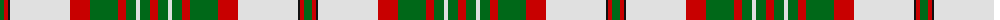

The parent of this is [Scott Dress Tartan Tartan Number: 1006. Earliest known date: pre 2003 Based on the 'Red' Scott from the Vestiarium Scoticum. See products available Copyright © Blair Urquhart, Comrie, 2015](/tartans/g/8/r4/k2/ln60/r20/g28/r8/g10/ln4/g10/r/8/)

This was sourced from house-of-tartan.  It is a [11 stripes tartan](/stripes/stripes11/).

Original link http://www.house-of-tartan.scotland.net/house/TartanViewjs.asp?colr=Def&tnam=1006

## Thread count
G/8 R4 K2 LN60 R20 G28 R8 G10 LN4 G10 R/8

## Palette
Each colour and its ΔE from the base-6 reference it is a variant of.

| Colour | Shade | Base | ΔE (OKLab) |
|---|---|---|---|
| G |  `#006818` | G  | 0.02 |
| K |  `#101010` | K  | 0.17 |
| LN |  `#E0E0E0` | W  | 0.06 |
| R |  `#C80000` | R  | 0.00 |

ID: /variants/g/8/r4/k2/ln60/r20/g28/r8/g10/ln4/g10/r/8-g006818-k101010-lne0e0e0-rc80000/
