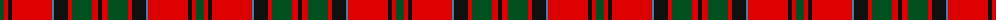

The parent of this is [MacKillop (Scottish Tartan Society)](/tartans/g/8/r4/k4/r40/b2/k14/r4/g20/r6/k/4/)

This was sourced from register-of-tartans.  It is a [10 stripes tartan](/stripes/stripes10/).

Original link https://www.tartanregister.gov.uk/tartanDetails.aspx?ref=2539

## Thread count
G/8 R4 K4 R40 B2 K14 R4 G20 R6 K/4

## Palette
Each colour and its ΔE from the base-6 reference it is a variant of.

| Colour | Shade | Base | ΔE (OKLab) |
|---|---|---|---|
| B |  `#3C82AF` | B  | 0.20 |
| G |  `#005020` | G  | 0.08 |
| K |  `#101010` | K  | 0.17 |
| R |  `#DC0000` | R  | 0.04 |

ID: /variants/g/8/r4/k4/r40/b2/k14/r4/g20/r6/k/4-b3c82af-g005020-k101010-rdc0000/
