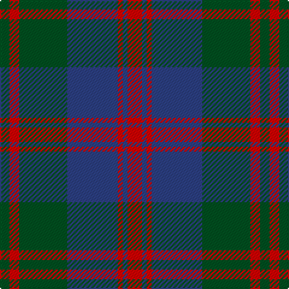

The parent of this is [Robertson of Struan](/tartans/g/8/r8/g40/b42/r4/b4/r/12/)

This was sourced from register-of-tartans.  It is a [7 stripes tartan](/stripes/stripes7/).

Original link https://www.tartanregister.gov.uk/tartanDetails.aspx?ref=3535

## Thread count
G/8 R8 G40 B42 R4 B4 R/12

## Palette
Each colour and its ΔE from the base-6 reference it is a variant of.

| Colour | Shade | Base | ΔE (OKLab) |
|---|---|---|---|
| B |  `#2C4084` | B  | 0.00 |
| G |  `#005020` | G  | 0.08 |
| R |  `#DC0000` | R  | 0.04 |

# Sample pattern

ID: /variants/g/8/r8/g40/b42/r4/b4/r/12-b2c4084-g005020-rdc0000/
