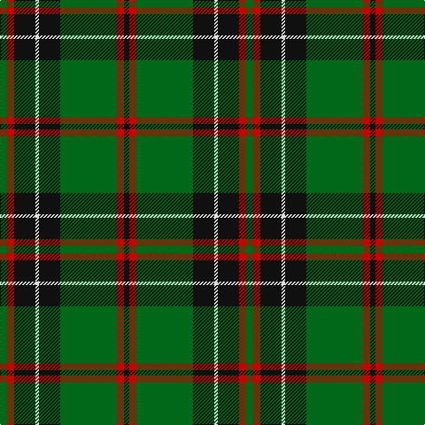

The parent of this is [MacHardy (Clans Originaux)](/tartans/g/8/r8/k24/ln4/k24/g64/r8/k/6/)

This was sourced from register-of-tartans.  It is a [8 stripes tartan](/stripes/stripes8/).

Original link https://www.tartanregister.gov.uk/tartanDetails.aspx?ref=2467

## Thread count
G/8 R8 K24 LN4 K24 G64 R8 K/6

## Palette
Each colour and its ΔE from the base-6 reference it is a variant of.

| Colour | Shade | Base | ΔE (OKLab) |
|---|---|---|---|
| G |  `#006818` | G  | 0.02 |
| K |  `#101010` | K  | 0.17 |
| LN |  `#E0E0E0` | W  | 0.06 |
| R |  `#C80000` | R  | 0.00 |

# Sample pattern

ID: /variants/g/8/r8/k24/ln4/k24/g64/r8/k/6-g006818-k101010-lne0e0e0-rc80000/
