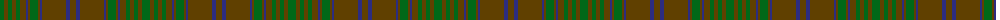

The parent of this is [MacAlister of Glenbarr Clan Tartan Tartan Number: 910. Earliest known date: pre 1984 This version of the MacAlister of Glenbarr tartan is the same as the MacGillivray hunting tartan. This sample was taken from a piece woven by Lochcarron Weavers around 1984. See products available Copyright © Blair Urquhart, Comrie, 2015](/tartans/g/8/t4/g4/t4/g4/t6/db2/t2/g8/t2/db2/t24/db4/t/6/)

This was sourced from house-of-tartan.  It is a [14 stripes tartan](/stripes/stripes14/).

Original link http://www.house-of-tartan.scotland.net/house/TartanViewjs.asp?colr=Def&tnam=910

## Thread count
G/8 T4 G4 T4 G4 T6 DB2 T2 G8 T2 DB2 T24 DB4 T/6

## Palette
Each colour and its ΔE from the base-6 reference it is a variant of.

| Colour | Shade | Base | ΔE (OKLab) |
|---|---|---|---|
| DB |  `#2C2C80` | B  | 0.05 |
| G |  `#006818` | G  | 0.02 |
| T |  `#604000` | G  | 0.14 |

ID: /variants/g/8/t4/g4/t4/g4/t6/db2/t2/g8/t2/db2/t24/db4/t/6-db2c2c80-g006818-t604000/
