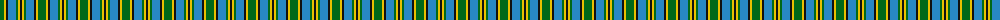
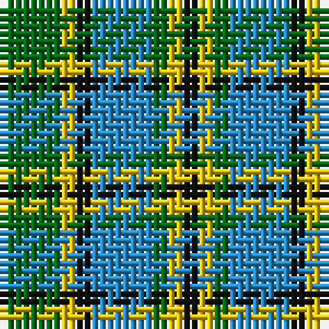

The parent of this is [Verble (Personal)](/tartans/g/8/y2/k2/b8/g2/y2/k/2/)

This was sourced from tartans-authority.  It is a [7 stripes tartan](/stripes/stripes7/).

Original link http://www.tartansauthority.com/tartan-ferret/display/6659/

## Thread count
G/8 Y2 K2 B8 G2 Y2 K/2

## Palette
Each colour and its ΔE from the base-6 reference it is a variant of.

| Colour | Shade | Base | ΔE (OKLab) |
|---|---|---|---|
| B |  `#2888C4` | B  | 0.21 |
| G |  `#006818` | G  | 0.02 |
| K |  `#101010` | K  | 0.17 |
| Y |  `#E8C000` | Y  | 0.00 |

# Sample pattern

ID: /variants/g/8/y2/k2/b8/g2/y2/k/2-b2888c4-g006818-k101010-ye8c000/
