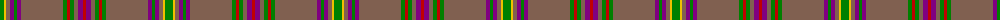

The parent of this is [Sarna](/tartans/g/8/y2/lt4/p4/g3/p4/lt42/g4/r3/g4/lt4/p5/r/3/)

This was sourced from weddslist.  It is a [13 stripes tartan](/stripes/stripes13/).

Original link http://www.weddslist.com/cgi-bin/tartans/pg.pl?source=sts

## Thread count
G/8 Y2 LT4 P4 G3 P4 LT42 G4 R3 G4 LT4 P5 R/3

## Palette
Each colour and its ΔE from the base-6 reference it is a variant of.

| Colour | Shade | Base | ΔE (OKLab) |
|---|---|---|---|
| G |  `#008000` | G  | 0.09 |
| LT |  `#806050` | R  | 0.17 |
| P |  `#800080` | B  | 0.17 |
| R |  `#C00000` | R  | 0.02 |
| Y |  `#F0C000` | Y  | 0.01 |

ID: /variants/g/8/y2/lt4/p4/g3/p4/lt42/g4/r3/g4/lt4/p5/r/3-g008000-lt806050-p800080-rc00000-yf0c000/
