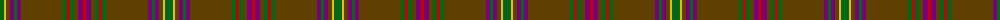

The parent of this is [Sarna (District)](/tartans/g/8/y2/t4/p4/g3/p4/t42/g4/r3/g4/t4/p5/r/3/)

This was sourced from tartans-authority.  It is a [13 stripes tartan](/stripes/stripes13/).

Original link http://www.tartansauthority.com/tartan-ferret/display/2558/

## Thread count
G/8 Y2 T4 P4 G3 P4 T42 G4 R3 G4 T4 P5 R/3

## Palette
Each colour and its ΔE from the base-6 reference it is a variant of.

| Colour | Shade | Base | ΔE (OKLab) |
|---|---|---|---|
| G |  `#006818` | G  | 0.02 |
| P |  `#780078` | B  | 0.16 |
| R |  `#C80000` | R  | 0.00 |
| T |  `#604000` | G  | 0.14 |
| Y |  `#E8C000` | Y  | 0.00 |

ID: /variants/g/8/y2/t4/p4/g3/p4/t42/g4/r3/g4/t4/p5/r/3-g006818-p780078-rc80000-t604000-ye8c000/
