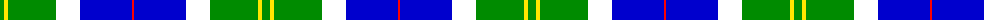

The parent of this is [Vancouver Centennial](/tartans/g/8/y4/g48/w24/b52/r/2/)

This was sourced from register-of-tartans.  It is a [6 stripes tartan](/stripes/stripes6/).

Original link https://www.tartanregister.gov.uk/tartanDetails.aspx?ref=4442

## Thread count
G/8 Y4 G48 W24 B52 R/2

## Palette
Each colour and its ΔE from the base-6 reference it is a variant of.

| Colour | Shade | Base | ΔE (OKLab) |
|---|---|---|---|
| B |  `#0000CD` | B  | 0.15 |
| G |  `#008B00` | G  | 0.12 |
| R |  `#FF0000` | R  | 0.11 |
| W |  `#FFFFFF` | W  | 0.03 |
| Y |  `#FFE600` | Y  | 0.10 |

# Sample pattern

ID: /variants/g/8/y4/g48/w24/b52/r/2-b0000cd-g008b00-rff0000-wffffff-yffe600/
