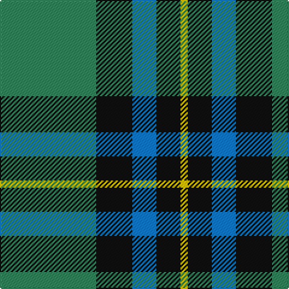

The parent of this is [U.S. Border Patrol (Corporate)](/tartans/g/80/k30/b20/k20/y/6/)

This was sourced from tartans-authority.  It is a [5 stripes tartan](/stripes/stripes5/).

Original link http://www.tartansauthority.com/tartan-ferret/display/6182/

## Thread count
G/80 K30 B20 K20 Y/6

## Palette
Each colour and its ΔE from the base-6 reference it is a variant of.

| Colour | Shade | Base | ΔE (OKLab) |
|---|---|---|---|
| B |  `#1474B4` | B  | 0.15 |
| G |  `#408060` | G  | 0.13 |
| K |  `#101010` | K  | 0.17 |
| Y |  `#E8C000` | Y  | 0.00 |

# Sample pattern

ID: /variants/g/80/k30/b20/k20/y/6-b1474b4-g408060-k101010-ye8c000/
