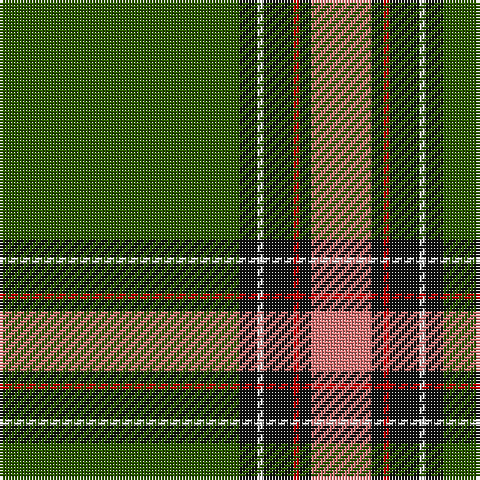

The parent of this is [Aviemore Highland](/tartans/g/80/k6/ln2/k10/r2/k4/lr/20/)

This was sourced from register-of-tartans.  It is a [7 stripes tartan](/stripes/stripes7/).

Original link https://www.tartanregister.gov.uk/tartanDetails.aspx?ref=149

## Thread count
G/80 K6 LN2 K10 R2 K4 LR/20

## Palette
Each colour and its ΔE from the base-6 reference it is a variant of.

| Colour | Shade | Base | ΔE (OKLab) |
|---|---|---|---|
| B |  `#48A4C0` | Y  | 0.28 |
| DG |  `#003820` | G  | 0.16 |
| G |  `#285800` | G  | 0.04 |
| K |  `#101010` | K  | 0.17 |
| LN |  `#E0E0E0` | W  | 0.06 |
| LR |  `#E87878` | R  | 0.19 |
| O |  `#E86000` | R  | 0.14 |
| R |  `#C80000` | R  | 0.00 |

# Sample pattern

ID: /variants/g/80/k6/ln2/k10/r2/k4/lr/20-b48a4c0-dg003820-g285800-k101010-lne0e0e0-lre87878-oe86000-rc80000/
