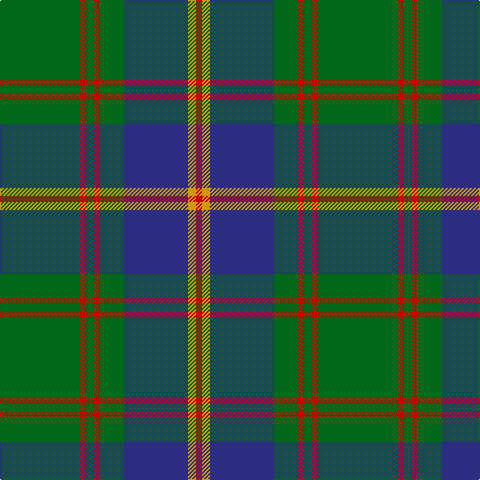

The parent of this is [US Marine Corps](/tartans/g/80/r6/g8/r6/g24/db64/dy8/r/6/)

This was sourced from register-of-tartans.  It is a [8 stripes tartan](/stripes/stripes8/).

Original link https://www.tartanregister.gov.uk/tartanDetails.aspx?ref=4187

## Thread count
G/80 R6 G8 R6 G24 DB64 DY8 R/6

## Palette
Each colour and its ΔE from the base-6 reference it is a variant of.

| Colour | Shade | Base | ΔE (OKLab) |
|---|---|---|---|
| DB |  `#2C2C80` | B  | 0.05 |
| DY |  `#D09800` | Y  | 0.11 |
| G |  `#006818` | G  | 0.02 |
| R |  `#C80000` | R  | 0.00 |

# Sample pattern

ID: /variants/g/80/r6/g8/r6/g24/db64/dy8/r/6-db2c2c80-dyd09800-g006818-rc80000/
