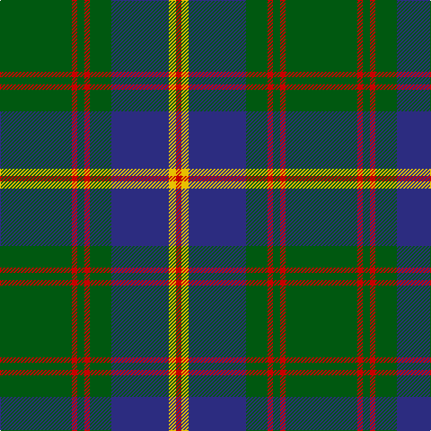

The parent of this is [U.S. Marine Corps (Military?)](/tartans/g/80/r6/g8/r6/g24/db64/y8/r/6/)

This was sourced from tartans-authority.  It is a [8 stripes tartan](/stripes/stripes8/).

Original link http://www.tartansauthority.com/tartan-ferret/display/975/

## Thread count
G/80 R6 G8 R6 G24 DB64 Y8 R/6

## Palette
Each colour and its ΔE from the base-6 reference it is a variant of.

| Colour | Shade | Base | ΔE (OKLab) |
|---|---|---|---|
| DB |  `#2C2C80` | B  | 0.05 |
| G |  `#005810` | G  | 0.04 |
| R |  `#C80000` | R  | 0.00 |
| Y |  `#E8C000` | Y  | 0.00 |

# Sample pattern

ID: /variants/g/80/r6/g8/r6/g24/db64/y8/r/6-db2c2c80-g005810-rc80000-ye8c000/
