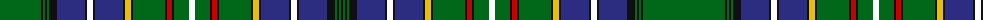

The parent of this is [Ayre Personal Tartan Tartan Number: 6305. Earliest known date: 1819 This is Wilsons No. 038 (1819) and has been adopted by David Ayre of Kilmarnock as a private family tartan. See #805. See products available Copyright © Blair Urquhart, Comrie, 2015](/tartans/g/82/k2/g2/k2/g2/k8/db28/k2/w6/k2/db28/k2/y6/k2/g32/k2/r5/k2/g15/w6/g15/k2/r5/k2/g32/k2/y6/k2/db28/k2/w6/k2/db28/k8/g2/k2/g2/k/2/)

This was sourced from house-of-tartan.  It is a [38 stripes tartan](/stripes/stripes38/).

Original link http://www.house-of-tartan.scotland.net/house/TartanViewjs.asp?colr=Def&tnam=6305

## Thread count
G/82 K2 G2 K2 G2 K8 DB28 K2 W6 K2 DB28 K2 Y6 K2 G32 K2 R5 K2 G15 W6 G15 K2 R5 K2 G32 K2 Y6 K2 DB28 K2 W6 K2 DB28 K8 G2 K2 G2 K/2

## Palette
Each colour and its ΔE from the base-6 reference it is a variant of.

| Colour | Shade | Base | ΔE (OKLab) |
|---|---|---|---|
| B |  `#1474B4` | B  | 0.15 |
| DB |  `#2C2C80` | B  | 0.05 |
| G |  `#006818` | G  | 0.02 |
| K |  `#101010` | K  | 0.17 |
| R |  `#C80000` | R  | 0.00 |
| W |  `#FCFCFC` | W  | 0.03 |
| Y |  `#E8C000` | Y  | 0.00 |

ID: /variants/g/82/k2/g2/k2/g2/k8/db28/k2/w6/k2/db28/k2/y6/k2/g32/k2/r5/k2/g15/w6/g15/k2/r5/k2/g32/k2/y6/k2/db28/k2/w6/k2/db28/k8/g2/k2/g2/k/2-b1474b4-db2c2c80-g006818-k101010-rc80000-wfcfcfc-ye8c000/
